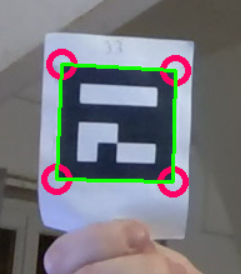
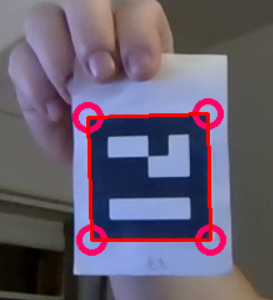
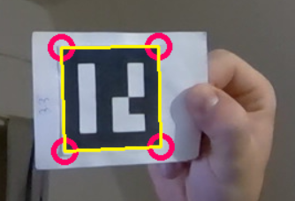

# ✅❌ Machine de vote avec marqueurs ArUco

Ce projet consiste en une  machine de vote en direct selon un flux vidéo.
Pour cela, le programme se base essentiellement sur la bibliothèque OpenCV qui permet la détection
de marqueurs ArUco. 

Le programme permet de faire voter plusieurs questions à une assemblée
selon une séquence fixée. Le vote est dit “à scrutin public”, c’est-à-dire que le programme permet de
déterminer qui a voté quoi.

---

# 🎯 Principe

On commence par lister les questions posées dans le fichier `questions.json`.

On distribue alors à chaque votant une pancarte avec un marqueur ArUco unique, dont on connait l'identifiant. On inscrit alors le votant dans le fichier `participants.json` en l'associant à son identifiant. 

Au lancement du programme, on sélectionne un mode de fonctionnement : 
- `Mode automatique` en appuyant sur `t` où les questions défilent avec une temporisation
- `Mode manuel` en appuyant sur `y` où chaque appuie de `y` fait passer à la question suivante

Les participants peuvent alors exprimer leur vote en présentant leur marqueur ArUco selon 3 orientations du marqueur : 

1. `Droit` - Oui
2. `À l'envers` - Non
3. `Sur un côté` - Vote nul

<p align="center">
   
   
</p>

<p align="center">
   
</p>

Une fois les questions épuisées, un histogramme affiche les résultats du vote pour chaque question. Des résultat détaillant qui à voter quoi sont également disponibles dans le fichier `resultats.txt`.

---

# 📁 Structure du projet

```
aruco-machine-vote/
│
├── programme.py           # Programme principal
├── questions.json         # Liste des questions
├── participants.json      # Liste des participants avec leur identifiant ArUco
├── images/                # Illusrations pour le readme
├── .gitignore
├── README.md
└── LICENSE.txt
```

---
# 👨‍🏭 Auteur

**Pierre Bourrandy** - **ENSIL-ENSCI**

Ce projet a été réalisé dans le cadre du module d'informatique de 2ème année de Formation Initiale aux Métiers d'Ingénieurs. 

## Contact detail
pierre.bourrandy@etu.unilim.fr *(ENSIL-ENSCI)*

https://github.com/Cnpruat/arcuo-machine-vote *(GitHub)*

